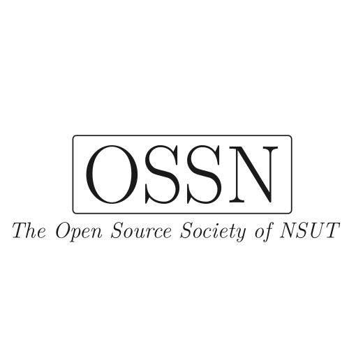

    <picture>
        <source media="(prefers-color-scheme: dark)" srcset="./.github/showcase/favicon-dark.svg" >
        
    </picture>
<h1>The Website</h1>

The source code of OSSN's website built using [Hugo](https://gohugo.io/), a static site generator.

## Contributing

We welcome contributions from everyone. Please read our [contributing guidelines](CONTRIBUTING.md) to get started.
